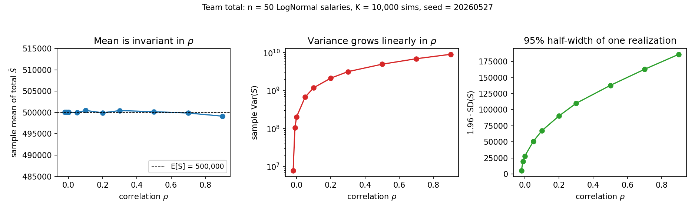

# The Most Useful Theorem in Probability Has No Independence Hypothesis

## Hook

Open any probability textbook. Independence shows up by page 30 and never leaves. The Central Limit Theorem needs it. The Law of Large Numbers needs it. The variance of a sum needs it. So when you add random things — daily revenues, team salaries, model errors — your instinct is to check independence first. There is exactly one result in everyday probability that breaks the pattern. You have been using it without checking the fine print.

## Insight

**Linearity of expectation** says: for any random variables $X_1, \ldots, X_n$ with finite expectations,

$$
E\!\left[\sum_{i=1}^n X_i\right] = \sum_{i=1}^n E[X_i].
$$

No independence. No common distribution. Not even pairwise uncorrelatedness. The variables can share the same coin flip, or be deterministic functions of one another — the identity still holds.

The proof is one line: expectation is an integral, and integration is linear. That is the entire structural reason — there is nothing else. By contrast, the analogous statement for products, $E[XY] = E[X]\,E[Y]$, **fails** without independence. Multiplication is not linear, and the joint distribution genuinely matters. The mean of a sum and the mean of a product are different problems with different prerequisites.

## Example

A 50-person team. Each monthly salary $S_i$ is LogNormal with $E[S_i] = R\$\, 10{,}000$ and a coefficient of variation of about 20%. Salaries within the team share drivers — role, band, location, market dynamics — so they are correlated, with $\rho \approx 0.2$ a defensible central estimate.

**Question 1: what is the expected total monthly budget?** Linearity gives the answer immediately:

$$
E\!\left[\sum_{i=1}^{50} S_i\right] = 50 \cdot 10{,}000 = R\$\, 500{,}000.
$$

The correlation does not appear. It cannot appear. Even if the salaries moved in lockstep, the expected total would still be R\$ 500,000.

**Question 2: how uncertain is that total?** Different problem entirely. The variance of the sum picks up a cross term for every pair:

$$
\text{Var}(S) = 50\, \sigma^2 \big(1 + 49\rho\big).
$$

At $\rho = 0.2$, that is roughly $10.8\times$ the independent-case variance. The 95% band on the realized total is about $3.3\times$ wider than independence suggests — a big enough error to matter in any quarterly planning exercise.

*Same marginals across $\rho \in [-0.02, 0.9]$. The mean of the total is invariant (left). The variance climbs by more than an order of magnitude (middle). The 95% half-width of the realized total tracks the standard deviation (right).*

## Takeaway

Two rules to keep separate:

- **Mean of a sum:** ignore the correlation structure. The marginals fix the answer.
- **Variance, 95% band, or any tail risk of a sum:** the correlation is the whole game.

Confusing the two produces budgets whose central estimates are right but whose risk bands are off by a factor of three. The kind of error that is invisible until the quarter when everything correlates at once.
